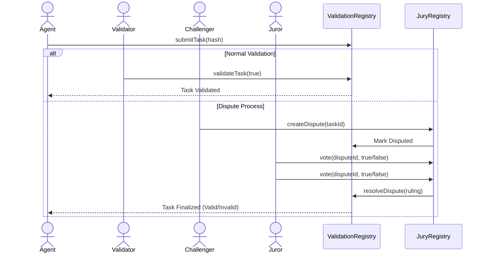

# ERC-8004 POC: Ethereum AI Agent Registration

This project is a Proof of Concept (POC) for **ERC-8004**, a standard for registering AI Agents on the Ethereum blockchain. It demonstrates the core concepts of Agent Identity, Incentivized Validation, Reputation, and Indexing.

## Features

*   **Agent Identity Registry**: ERC-721 contract to register AI Agents with unique IDs and metadata.
*   **Agent Validation Registry**: System for agents to submit tasks with a **validation fee**, paid to validators upon verification.
*   **Agent Reputation Registry**: System to record and retrieve reputation scores and reviews.
*   **Agent Service Registry**: Registry for agents to list their available services/resources.
*   **Indexer (Ponder)**: A local‑first indexer that aggregates on‑chain events into a queryable GraphQL API.
*   **Agent Explorer (Frontend)**: A Next.js web interface to discover agents and view their reputation/history.

## Prerequisites

*   **Node.js**: v18 or higher (Recommended: v20 LTS or v22 LTS).
    *   *Note*: Avoid Node.js v25+ due to potential Hardhat compatibility issues.
*   **npm**: Installed with Node.js.
*   **Git**: For cloning the repository.

## 🚀 Quick Start Guide

Follow these steps in order to run the entire system.

### Step 1: Install Dependencies

Install dependencies for all components:

```bash
# Root dependencies (Hardhat)
npm install

# Indexer dependencies
cd ponder && npm install && cd ..

# Frontend dependencies
cd frontend && npm install && cd ..
```

### Step 2: Start Local Blockchain

Open **Terminal 1** and start the Hardhat node:

```bash
npx hardhat node
```

**⚠️ Important:** Keep this terminal running. The local blockchain will be at `http://127.0.0.1:8545`.

### Step 3: Deploy Contracts

Open **Terminal 2** and run the dedicated deployment script:

```bash
npx hardhat run scripts/deployAll.js --network localhost
```

The script will:
* Deploy **AgentIdentityRegistry**, **AgentReputationRegistry**, **AgentValidationRegistry**, **AgentServiceRegistry**, and **AgentJuryRegistry**.
* Wire the Validation Registry to the Jury Registry.
* Write all deployed addresses to `scripts/deployment.json`.

You will see output similar to:

```text
AgentIdentityRegistry deployed to: 0x2279B7A0a67DB372996a5FaB50D91eAA73d2eBe6
AgentReputationRegistry deployed to: 0x8A791620dd6260079BF849Dc5567aDC3F2FdC318
AgentValidationRegistry deployed to: 0x610178dA211FEF7D417bC0e6FeD39F05609AD788
AgentServiceRegistry deployed to: 0xB7f8BC63BbcaD18155201308C8f3540b07f84F5e
AgentJuryRegistry deployed to: 0xA51c1fc2f0D1a1b8494Ed1FE312d7C3a78Ed91C0
Validation Registry wired to Jury Registry
Deployment addresses written to scripts/deployment.json
```

### Step 4: Update Ponder Configuration

**🔧 Update contract addresses** in `ponder/ponder.config.ts` with the addresses from `scripts/deployment.json`.

Open `ponder/ponder.config.ts` and replace the `address` fields, e.g.:

```typescript
contracts: {
    AgentIdentityRegistry: {
        abi: AgentIdentityRegistry.abi,
        address: "0x2279B7A0a67DB372996a5FaB50D91eAA73d2eBe6", // ← Update
        network: "hardhat",
        startBlock: 0,
    },
    // ... update the other 4 contracts similarly
}
```

> **💡 Tip:** Contract addresses change each time you restart the Hardhat node. Always update `ponder.config.ts` after a fresh deployment.

### Step 5: Start the Indexer

In **Terminal 2** (or a new terminal), start Ponder:

```bash
cd ponder
rm -rf .ponder  # Clear cache if restarting
npm run dev
```

**⚠️ Keep this running.** You should see:

```text
✓ GraphQL Server live at http://localhost:42069
✓ Indexing complete (1 agent, 1 service, 2 validations, 1 reputation)
```

### Step 6: Run the Demo Script

Now that the contracts are deployed, run the demo script which uses the pre‑deployed contracts:

```bash
npx hardhat run scripts/demo.js --network localhost
```

The script will:
* Register a demo agent and service.
* Submit a task with a fee and validate it.
* Add a reputation entry.
* Register a juror, create a dispute, vote, and execute a ruling.
* Verify and print all relevant data.

### Step 7: Start the Frontend

Open **Terminal 3** and start the Next.js frontend:

```bash
cd frontend
npm run dev
```

**⚠️ Keep this running.** Open [http://localhost:3000](http://localhost:3000) in your browser to see the Agent Explorer.

---

## 🧪 Testing Use Cases

### Use Case 1: Basic Agent Workflow ✅

The `demo.js` script (run in Step 6) already demonstrates:
* ✅ Agent registration
* ✅ Service registration
* ✅ Task submission with fee
* ✅ Task validation by validator
* ✅ Reputation score added

**Verify**: Visit [localhost:3000](http://localhost:3000) to see Agent #1 with 1 service and validation history.

### ⚖️ Use Case 2: Dispute Resolution (Jury)

Simulate a malicious agent submitting an invalid task, which is challenged and slashed by a jury.

In **Terminal 4**, run:

```bash
npx hardhat run scripts/demo_jury.js --network localhost
```

**What happens:**
1.  Agent submits a task.
2.  Challenger raises a dispute (staking a fee).
3.  Jurors vote (e.g., 2 vote "Invalid", 1 votes "Valid").
4.  **Ruling Executed**: The agent is slashed.
5.  **Incentives**: The Challenger and winning jurors are rewarded with the slashed funds.
6.  **Check the Frontend**: Go to the agent's detail page to see the disputed task marked with ⚠️.

---

## 🔄 The ERC-8004 Workflow

### Visual Workflow


### Step‑by‑Step
1.  **Registration**: Agent registers identity and services.
2.  **Service Discovery**: Users find agents via the Indexer.
3.  **Task Execution**: Agent performs work and submits a hash of the result to `AgentValidationRegistry`.
4.  **Validation**:
    *   **Optimistic**: A validator confirms the result.
    *   **Dispute**: If the result is suspicious, a Challenger raises a dispute in `AgentJuryRegistry`.
5.  **Resolution**: Jurors vote on the dispute. The majority ruling is executed on‑chain.

---

## 💰 Incentive Mechanism

### 1. Registration
Agents mint an NFT ID via `AgentIdentityRegistry`. This establishes their on‑chain identity.

### 2. Staking
*   **Agents**: Must stake ETH to register. This stake is slashed if they act maliciously.
*   **Jurors**: Must stake ETH to participate in the court. This ensures they have "skin in the game".

### 3. Game Theory (Schelling Point)
The system uses a **Schelling Point** mechanism to incentivize honest voting without a central authority.
*   **Concept**: Jurors are rewarded for voting with the majority. Since the "truth" is the only common focal point that everyone expects others to vote for, honest voting becomes the dominant strategy.
*   **Loser Pays**:
    *   **If Agent Wins (Valid)**: The Challenger loses their dispute fee. This fee is distributed to the jurors who voted "Valid".
    *   **If Agent Loses (Invalid)**: The Agent's task fee (and potentially stake) is slashed. The Challenger gets their fee back + a reward. The remaining slashed funds are distributed to jurors who voted "Invalid".
*   **Result**: Spam disputes are costly (Challenger pays), and malicious agents are punished (Agent pays). Honest behavior is profitable.

### 4. Task Submission (Commitment)
Agents perform work off‑chain and submit a **hash** of the result to `AgentValidationRegistry` along with a fee.
*   `submitTask(agentId, taskHash) payable`

### 5. Validation
Validators verify the off‑chain work against the committed hash. If correct, they validate it on‑chain and claim the fee.
*   `validateTask(taskId, isValid)`

### 5. Reputation
Users leave reviews for agents in `AgentReputationRegistry`, building a trust score over time.

---

## Project Structure

*   `contracts/`: Solidity smart contracts.
*   `scripts/`: Deployment and demo scripts.
*   `ponder/`: The Ponder indexer project.
    *   `ponder.config.ts`: Network and contract configuration.
    *   `ponder.schema.ts`: Database schema definition.
    *   `src/index.ts`: Event indexing logic.
*   `hardhat.config.js`: Hardhat configuration.

---

## Troubleshooting

*   **Indexer not picking up events?**
    *   Ensure `ponder.config.ts` has the correct contract addresses. If you restarted the Hardhat node, addresses might have changed (though Hardhat is deterministic, so they usually stay the same if deployment order is constant).
    *   Ensure the Hardhat node is running (`npx hardhat node`).
*   **"Class extends value undefined" error?**
    *   This is a known issue with Node.js v25+. Please downgrade to Node.js v20 or v22.

---

## License

MIT
